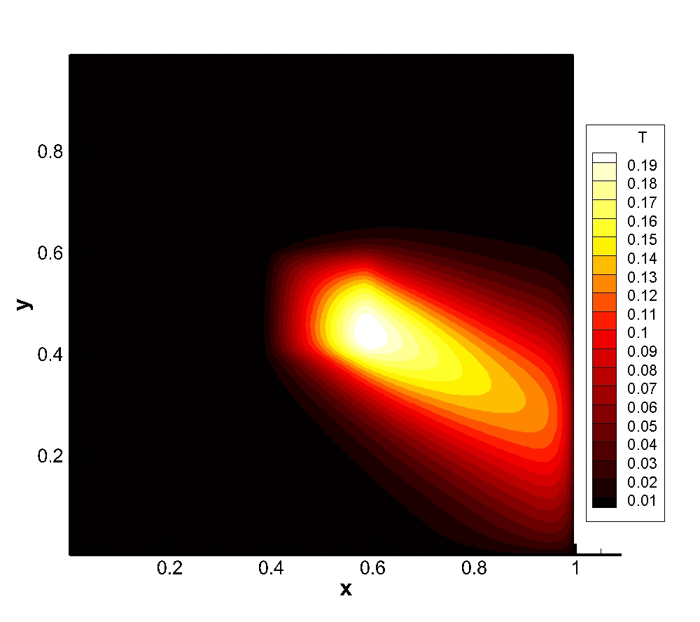

## About

ALDESIA is a toy program written by `C++` that aims to guide the undergraduate students into the colorful world of CFD and Discrete-Adjoint method. ALDESIA can solve linear convection-diffusion problem and its adjoint. ALDESIA relies on `CodiPack` and `IniReader`.

As far as the author know, mastering CFD is not simple, not to mention understanding the Discrete-Adjoint algorithm that generates the gradient of a function defined by CFD. Popular software dealing with CFD and Discrete-Adjoint method appears to be too difficult for beginners to understand due to the huge volume of code and the complexity of the problem the software aims to solve. 

Different from the software mentioned above, ALDESIA solves simple problem (convection-diffusion problem, definitely not the kind of problem that can be written into an academic paper) and has only about 2000 lines of code (codes in `CodiPack`and `iniReader` are not counted). The author believes that ALDESIA's simplicity can help the students who have weak background in CFD and Discrete-Adjoint take the very first steps in their CFD career and cultivate their interest in CFD and Aerodynamic Optimization.

ALDESIA is written by Wcy, School of Aerospace engineering, Tsinghua University. ALDESIA is certainly not perfect and bunch of flaws definitely exist since the author is also new in CFD and Discrete-Adjoint. If you have any suggestions to improve the performance of ALDESIA, you can contact the author by sending emails to wucy18@mails.tsinghua.edu.cn. 

## Features

### Problem and algorithm description

ALDESIA can now solve convection-diffusion problem in a 2-D rectangular domain using rectangular grid with mixed 2nd-order central and 1st-order upwind algorithm (the primal solver). The equation solved can be written as:


The Jacobian of the convection-diffusion problem solver (primal solver) is derived by the forward-mode auto-differentiation using `CoDiPack`  with graph-coloring. The Jacobian of the objective function is computed by the reverse-mode auto-differentiation of `CoDiPack`.  ALDESIA can solve the adjoint of the primal solver using the Jacobians derived:


Note that currently ALDESIA treats the distribution of the source term (S) as the design variable.

All linear equations in ALDESIA are now solved by naïve SOR algorithm.

### Programming features

ALDESIA is objective-oriented. All functions are integrated into the class `Aldesia` as its methods. An input file that defines the problem is needed to initialize an object of `Aldesia` (examples of the input file can be found in the `Example` directory):

```c++
std::string filename = {"input.ini"};
Aldesia solver(filename);
```

Then the user can solve the primal and adjoint by simply calling:

```C++
// solve primal
solver.solvePrimal(); 
// solve adjoint, the string is the name of the obj
solver.solveDA("averageTempreture"); 
```

For more details, please examine the source file of class `Aldesia`.

### `python` Wrapper

`pyALDESIAdef.pxd` and `pyALDESIA.pyx` are two `cython` files that define the `python` wrapper of ALDESIA. After correct installation of ALDESIA as an extension of `python`, one can use ALDESIA in a `python` script by importing the package and instantiating an object of ALDESIA: (note that the instantiation of ALDESIA object in python also uses an `.ini` file)

```python
import pyALDESIA
solver = pyALDESIA.ALDESIA(b'input.ini')
```

## Installation

It is tested that ALDESIA can be compiled on `Ubuntu-20.04 LTS` using `g++ 9.3.0`. Moreover, `conda` environment with `cython`, `numpy` and `setuptools` is also needed (to cythonize ALDESIA). To run the optimization, you have to install `pyoptsparse` in your `conda` environment.

If your system meets the requirements listed above, you can compile ALDESIA easily. Download the zip file of this repository and `unzip` it in a Linux system, `cd` to the destination you `unzip` ALDESIA and type the following command in your terminal:

```shell
./Allmake.sh
```

Then ALDESIA is compiled and installed as a python extension on the `conda` environment activated. To test if ALDESIA is successfully installed, run the cases in `Examples` directory by following the instructions in the next section.

## Examples

### Convection of heat generated by a rectangular source

`cd` to directory `Examples/PrimalSolver`. Then type the following command (make sure that you have activated the `conda` environment where you have installed ALDESIA):

```shell
python run.py
```

After pressing the enter key, ALDESIA will run the primal solver. The result will be stored in `0.plt` in the `primalSol` directory. If you copy the hole case file to windows system after running ALDESIA, you can open `postProcessing.lay` using Tecplot for post-processing.

The picture below is the phi distribution generated by ALDESIA's primal solver. The boundary value of phi is set to zero and there's a source located at the center of the domain. The velocity points in south-east direction.



### Gradient of average temperature

`cd` to directory `Examples/GradientAndJacobian`. Then type the following command (make sure that you have activated the `conda` environment where you have installed ALDESIA):

```shell
python run.py
```

Then ALDESIA will solve both the primal and the adjoint on a 4-times-4 grid. The velocity is set to zero and the source term is set to 1.0 on the center 4 grid cells of the domain. The grid size is kept small for convenient check of the gradient calculated. After ALDESIA finishes its job, you will see the following files are generated in the current directory:

```
- dFdW.dat
- dFdx.dat
- dRdWColored.dat
- dRdXColored.dat
- gradient.dat
- primalSol
  |- 0.plt
```

The first four files are the Jacobians and the `gradient.dat` file stores the gradient of average temperature with respect to the distribution of the source. The `.plt` file stores the result of the primal solver.

## Solve the optimization problem

**To run this case, you have to install `pyoptsparse` in the `conda` environment where you installed ALDESIA!**

`cd` to directory `Examples/Optimization`. Then type the following command (make sure that you have activated the `conda` environment where you have installed ALDESIA and pyOptSparse):

```shell
python optScript.py
```

Then ALDESIA will solve an optimization problem to maximize the average temperature of the domain under the following constraint:


where S(x, y) is the distribution of heat source and s is a positive number. The initial and optimized distribution of temperature and heat source is shown below:

